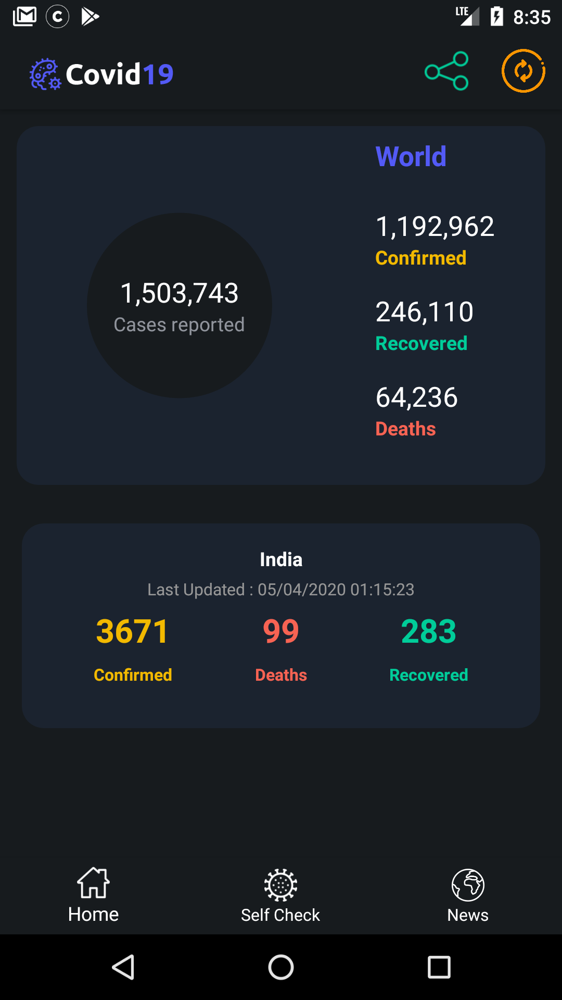
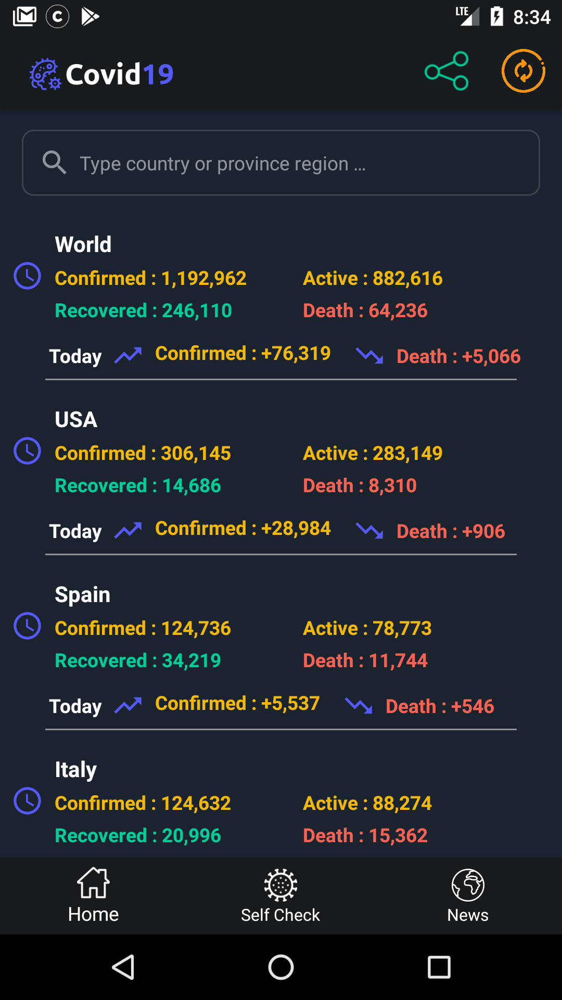
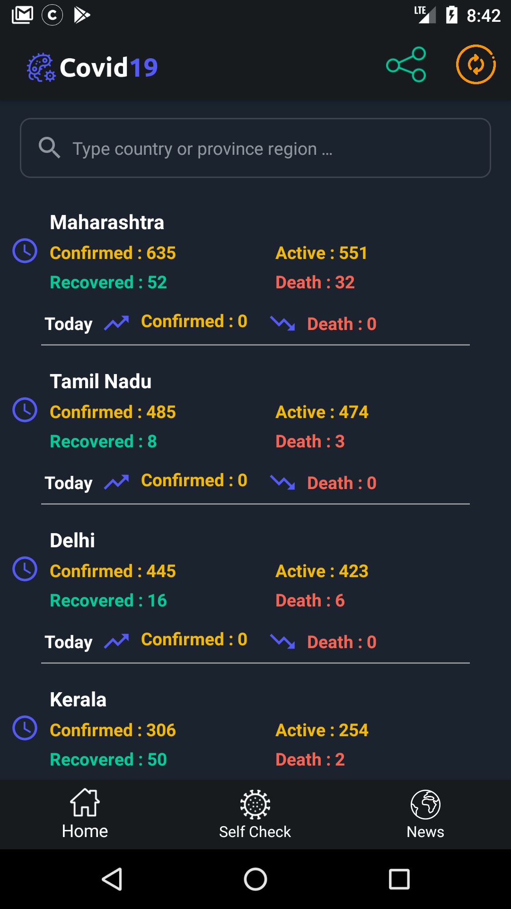

#Android covid19
This repository contains simple COVID19 data monitoring with android stack MVVM, Live Data, Koin, RxJava, RxBinding.

### Screenshots
<table>
  <tr>
    <td>Home</td>
     <td>World</td>
          <td>India</td>

  </tr>
  <tr>
    <td></td>
    <td></td>
    <td></td>

  </tr>
 </table>

#### Update
Since Google restrict app distribution about covid-19 on Google Play Store, we will upload latest feature apk [here](https://drive.google.com/folderview?id=1MaO9mIKWCFWSK2lFtEfKge1z8XDesi8n)

### Library References
1. RxJava2 
2. Koin 
3. Retrofit
4. RxBinding
6. [MPAndroidChart](https://github.com/PhilJay/MPAndroidChart)
10. Android ViewBinding

### License
```
   Copyright (C) 2020

   Licensed under the Apache License, Version 2.0 (the "License");
   you may not use this file except in compliance with the License.
   You may obtain a copy of the License at

       http://www.apache.org/licenses/LICENSE-2.0

   Unless required by applicable law or agreed to in writing, software
   distributed under the License is distributed on an "AS IS" BASIS,
   WITHOUT WARRANTIES OR CONDITIONS OF ANY KIND, either express or implied.
   See the License for the specific language governing permissions and
   limitations under the License.
```

### Contributing
Just make pull request. You are in!
